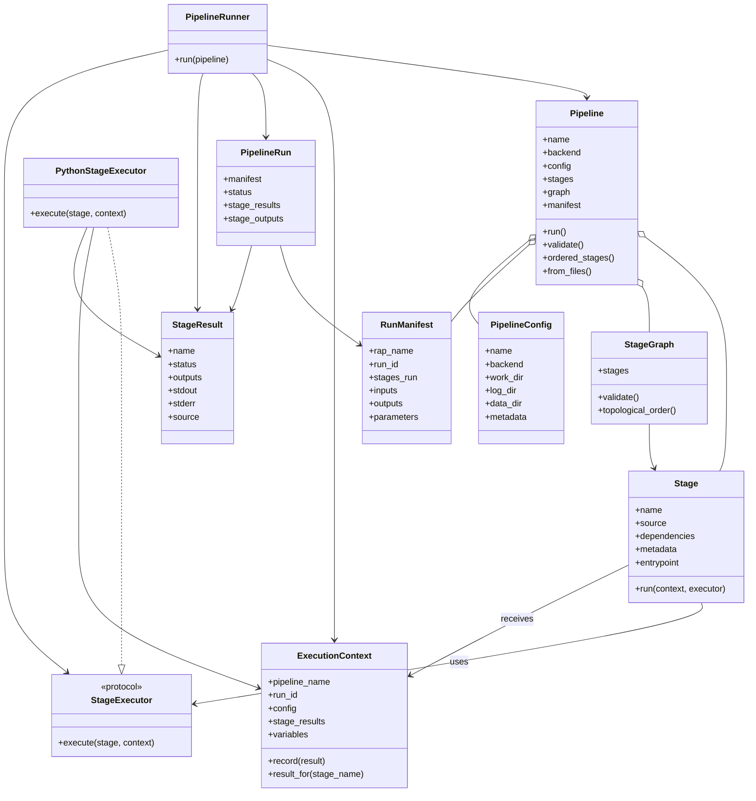
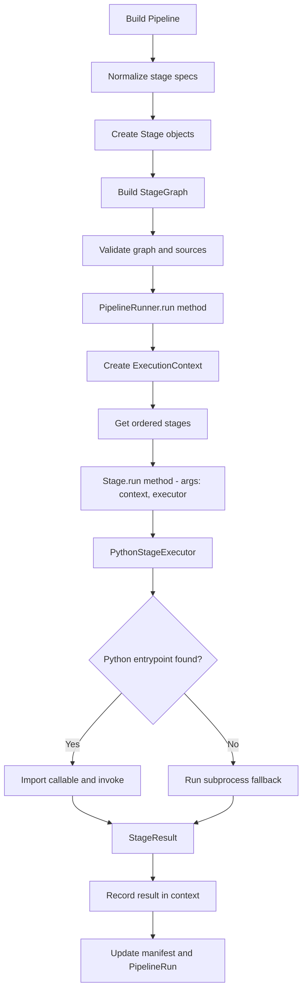

# onsrap Architecture

This document describes the current architecture of `onsrap` as a small pipeline orchestration package.

The design goal is simple: take a pipeline made of existing files or callables, turn them into ordered stages, execute them safely, and capture a useful run record without forcing the user into a heavyweight workflow engine.

## High-Level Shape

The package is intentionally split into a small set of responsibilities:

- `Pipeline` owns the pipeline definition, configuration, stage normalization, and manifest construction.
- `Stage` is a declarative description of one unit of work.
- `StageGraph` validates dependencies and produces an execution order.
- `PipelineRunner` executes the ordered stages and builds a `PipelineRun`.
- `PythonStageExecutor` interprets Python stage files when possible and falls back to subprocess execution for plain scripts.
- `ExecutionContext` carries run state between stages.
- `PipelineConfig`, `StageResult`, `RunManifest`, and `PipelineRun` are the data objects used to record what happened.
- `Logger` provides lightweight structured logging.

## Relationship Diagram

## Execution Flow

## Class Roles

### `Pipeline`

`Pipeline` is the public orchestration object. It is responsible for turning user input into a coherent pipeline:

- converts file paths, callables, and dictionaries into `Stage` objects
- stores `PipelineConfig`
- creates the `StageGraph`
- constructs the `RunManifest`
- delegates execution to `PipelineRunner`

This keeps the top-level API small: create a pipeline, validate it, run it.

### `Stage`

`Stage` describes one step in the pipeline. It holds:

- the stage name
- the source, which is either a Python file path or a callable
- dependency names
- metadata for bookkeeping
- an optional explicit entrypoint name

`Stage` does not own orchestration. Its job is to be a clean definition of work, not the worker itself.

### `StageGraph`

`StageGraph` provides dependency validation and ordering.

It rejects:

- duplicate stage names
- references to unknown dependencies
- dependency cycles

The graph keeps the pipeline deterministic and prevents execution from relying on the original input order when dependencies say otherwise.

### `PipelineRunner`

`PipelineRunner` performs the actual run loop.

It creates the `ExecutionContext`, walks the ordered stages, records each `StageResult`, and produces a `PipelineRun`. It is deliberately separate from `Pipeline` so the orchestration object stays lightweight and the execution policy can evolve independently.

### `ExecutionContext`

`ExecutionContext` is the shared runtime state passed into stages.

It holds:

- pipeline name and run id
- the current `PipelineConfig`
- the logger
- stage results accumulated so far
- a simple `variables` dictionary for stage outputs

This is the mechanism that lets later stages read outputs from earlier ones without requiring global state.

### `PythonStageExecutor`

`PythonStageExecutor` is the default execution policy for Python stages.

It supports two modes:

- interpret a Python file by loading a callable entrypoint such as `run`, `main`, or `execute`
- fall back to subprocess execution when the file is just a script

This gives the package flexibility: a stage can be a proper callable or a standalone script.

### `PipelineConfig`

`PipelineConfig` gathers run-time settings such as:

- `work_dir`
- `log_dir`
- `data_dir`
- backend settings
- arbitrary metadata

It is designed to be easy to create from a mapping or a YAML file, which makes pipeline definitions easy to externalize later.

### `RunManifest` and `PipelineRun`

`RunManifest` records the durable description of the run: what ran, in what order, with what inputs and outputs.

`PipelineRun` is the in-memory result of execution. It wraps the manifest and adds status, timestamps, stage results, and stage outputs.

The separation is useful:

- `RunManifest` is the audit record
- `PipelineRun` is the execution result object

### `StageResult`

`StageResult` is the unit of execution output. It records:

- the stage name
- status
- outputs
- stdout/stderr
- source location
- timestamps

This gives downstream consumers a consistent shape whether the stage was executed as a callable or as a subprocess.

### `Logger`

`Logger` is intentionally minimal. It writes structured messages and keeps the package free from a larger logging framework.

That is enough for a package of this size while still leaving room to replace or wrap the logger later.

## Why This Shape

The architecture favors explicitness and a low dependency footprint over abstraction-heavy infrastructure.

### Choices made on purpose

- Keep the pipeline definition declarative and separate from the execution engine.
- Use a graph object instead of assuming the input list is already valid.
- Treat stage execution results as first-class objects.
- Allow both file-based stages and callable stages.
- Pass a context object instead of relying on globals.

### Pros

- Easy to understand for small and medium pipelines.
- Stages are easy to test in isolation.
- Dependency mistakes are caught early.
- The runner can evolve without changing the pipeline API.
- The package can support simple scripts without forcing a refactor.

### Cons

- There is some overlap between declarative config and runtime objects.
- The current executor is Python-centric; additional backends will need a registry or adapter layer.
- Subprocess fallback is convenient, but it is less structured than pure callable execution.
- The graph implementation is intentionally lightweight, so it does not yet provide advanced DAG features such as parallel scheduling or retries.

## Example Deployment Pattern

The sample pipeline in `examples/pipeline_1/` shows the intended style:

- numbered scripts such as `0_data_validation.py`, `1_preprocessing.py`, `2_reporting.py`
- each script defines its own `main(...)` function and can still be run directly
- `main.py` wires the files together using `Pipeline.from_files(...)`
- the stages pass data forward through the `ExecutionContext` and stage outputs

That example is intentionally small, but it reflects a realistic deployment pattern for a simple data workflow: validate, transform, summarize.
